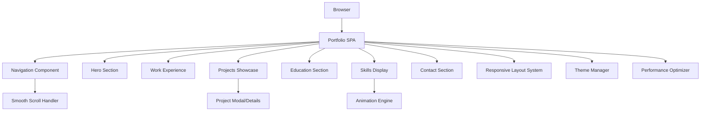

# Design Document: Personal Portfolio Website

## Overview

The personal portfolio website will be a single-page application (SPA) featuring a clean, modern design with smooth scrolling navigation and engaging animations. The design emphasizes visual hierarchy, professional aesthetics, and optimal user experience across all devices. The site will showcase personal achievements through strategically organized sections with interactive elements that enhance engagement without overwhelming the content.

## Architecture

### High-Level Architecture



### Technology Stack

**Frontend Framework**: React with Next.js for optimal performance and SEO
**Styling**: Tailwind CSS for utility-first styling with custom components
**Animations**: Framer Motion for smooth, performant animations
**Icons**: React Icons or Lucide React for consistent iconography
**Deployment**: Vercel for seamless deployment and performance optimization

### Component Architecture

The application follows a modular component structure:

- **Layout Components**: Header, Navigation, Footer
- **Section Components**: Hero, Experience, Projects, Education, Skills, Contact
- **UI Components**: Button, Card, Modal, Timeline, SkillBadge
- **Animation Components**: FadeIn, SlideIn, SkillsAnimation
- **Utility Components**: ScrollToTop, LoadingSpinner, SEO

## Components and Interfaces

### Navigation Component

**Purpose**: Provides smooth navigation between sections with active state indication

**Interface**:
```typescript
interface NavigationProps {
  activeSection: string;
  onSectionChange: (section: string) => void;
}

interface NavigationItem {
  id: string;
  label: string;
  href: string;
}
```

**Behavior**:
- Fixed position navigation that remains visible during scroll
- Smooth scroll to target sections when clicked
- Active section highlighting based on scroll position
- Mobile hamburger menu for smaller screens
- Keyboard navigation support

### Hero Section Component

**Purpose**: Creates compelling first impression with personal introduction

**Interface**:
```typescript
interface HeroProps {
  name: string;
  title: string;
  summary: string;
  profileImage: string;
  socialLinks: SocialLink[];
}

interface SocialLink {
  platform: string;
  url: string;
  icon: string;
}
```

**Behavior**:
- Animated text reveal on page load
- Professional headshot with subtle hover effects
- Call-to-action buttons for key actions (contact, resume download)
- Typing animation for dynamic title display

### Timeline Component

**Purpose**: Displays chronological information for work experience and education

**Interface**:
```typescript
interface TimelineProps {
  items: TimelineItem[];
  variant: 'work' | 'education';
}

interface TimelineItem {
  id: string;
  title: string;
  organization: string;
  startDate: Date;
  endDate: Date | null;
  description: string[];
  achievements?: string[];
  technologies?: string[];
}
```

**Behavior**:
- Vertical timeline layout with alternating sides on desktop
- Stacked layout for mobile devices
- Fade-in animation as items enter viewport
- Expandable details for each timeline item

### Skills Display Component

**Purpose**: Animated showcase of technical skills and proficiencies

**Interface**:
```typescript
interface SkillsDisplayProps {
  skillCategories: SkillCategory[];
  animationTrigger: boolean;
}

interface SkillCategory {
  name: string;
  skills: Skill[];
}

interface Skill {
  name: string;
  level: number; // 1-5 proficiency scale
  icon?: string;
  color?: string;
}
```

**Behavior**:
- Continuous scrolling animation of skill badges
- Multiple rows with different scroll speeds (parallax effect)
- Hover effects that pause animation and highlight skills
- Responsive grid layout that adapts to screen size
- Intersection Observer triggers animation when section is visible

### Project Showcase Component

**Purpose**: Displays portfolio projects with interactive details

**Interface**:
```typescript
interface ProjectShowcaseProps {
  projects: Project[];
  layout: 'grid' | 'masonry';
}

interface Project {
  id: string;
  title: string;
  description: string;
  technologies: string[];
  images: string[];
  liveUrl?: string;
  githubUrl?: string;
  featured: boolean;
}
```

**Behavior**:
- Masonry or grid layout for optimal space utilization
- Image galleries with lightbox functionality
- Filter system by technology or project type
- Hover effects revealing project details
- Modal or expanded view for detailed project information

### Contact Interface Component

**Purpose**: Provides multiple contact methods and social presence

**Interface**:
```typescript
interface ContactProps {
  contactMethods: ContactMethod[];
  socialLinks: SocialLink[];
  showContactForm: boolean;
}

interface ContactMethod {
  type: 'email' | 'phone' | 'location';
  value: string;
  icon: string;
}
```

**Behavior**:
- Contact form with validation and submission handling
- Direct links to email, social profiles, and professional networks
- Copy-to-clipboard functionality for email addresses
- Success/error states for form submissions

## Data Models

### Portfolio Data Structure

```typescript
interface PortfolioData {
  personal: PersonalInfo;
  experience: WorkExperience[];
  projects: Project[];
  education: Education[];
  skills: SkillCategory[];
  contact: ContactInfo;
}

interface PersonalInfo {
  name: string;
  title: string;
  summary: string;
  profileImage: string;
  resumeUrl?: string;
}

interface WorkExperience {
  id: string;
  company: string;
  position: string;
  startDate: Date;
  endDate: Date | null;
  location: string;
  responsibilities: string[];
  achievements: string[];
  technologies: string[];
}

interface Education {
  id: string;
  institution: string;
  degree: string;
  field: string;
  startDate: Date;
  endDate: Date;
  gpa?: number;
  honors?: string[];
  relevantCourses?: string[];
}

interface ContactInfo {
  email: string;
  phone?: string;
  location: string;
  socialLinks: SocialLink[];
  availability: string;
}
```

### Animation Configuration

```typescript
interface AnimationConfig {
  fadeIn: {
    duration: number;
    delay: number;
    easing: string;
  };
  skillsScroll: {
    speed: number;
    direction: 'left' | 'right';
    pauseOnHover: boolean;
  };
  timeline: {
    staggerDelay: number;
    slideDistance: number;
  };
}
```

## Correctness Properties

*A property is a characteristic or behavior that should hold true across all valid executions of a system—essentially, a formal statement about what the system should do. Properties serve as the bridge between human-readable specifications and machine-verifiable correctness guarantees.*

Based on the prework analysis, here are the key correctness properties for the portfolio system:

**Property 1: Required personal information display**
*For any* portfolio data configuration, the system should always display the person's name, title, professional summary, and profile image
**Validates: Requirements 1.2, 1.3**

**Property 2: Navigation structure completeness**
*For any* portfolio configuration, the navigation component should always provide links to Work Experience, Projects, Education, Technical Skills, and Contact sections
**Validates: Requirements 2.1**

**Property 3: Navigation behavior consistency**
*For any* navigation link click, the system should smoothly scroll to the corresponding section and update the active section indicator
**Validates: Requirements 2.2, 2.5**

**Property 4: Responsive navigation accessibility**
*For any* screen size, the navigation component should remain functional and accessible
**Validates: Requirements 2.3**

**Property 5: Data completeness across sections**
*For any* data item (work experience, project, or education), the system should display all required information fields when they exist in the data
**Validates: Requirements 3.2, 4.1, 5.1**

**Property 6: Conditional content rendering**
*For any* data item with optional fields (achievements, links, honors), the system should display these fields when they exist and omit them when they don't
**Validates: Requirements 4.2, 5.2, 7.2**

**Property 7: Chronological data ordering**
*For any* collection of time-based data (work experience, education), the system should display items in reverse chronological order (most recent first)
**Validates: Requirements 3.1, 5.3**

**Property 8: Project visual requirements**
*For any* project in the showcase, the system should include visual representations and organize them in a grid or card-based layout
**Validates: Requirements 4.3, 4.4**

**Property 9: Interactive project behavior**
*For any* project card interaction, the system should provide additional details or navigation options
**Validates: Requirements 4.5**

**Property 10: Skills categorization and animation**
*For any* skills data, the system should categorize skills by type and present them with animated visual elements
**Validates: Requirements 6.1, 6.2**

**Property 11: Viewport-triggered animations**
*For any* skills section that comes into view, the system should trigger smooth animations
**Validates: Requirements 6.3**

**Property 12: Skills proficiency visualization**
*For any* skill with proficiency data, the system should include visual representations of skill levels
**Validates: Requirements 6.4**

**Property 13: Contact methods availability**
*For any* portfolio configuration, the contact interface should provide multiple contact methods and social links
**Validates: Requirements 7.1, 7.2**

**Property 14: Contact link functionality**
*For any* contact link click, the system should open the appropriate application or website
**Validates: Requirements 7.3**

**Property 15: Comprehensive responsive design**
*For any* screen size (desktop, tablet, mobile), the system should adapt content layout and ensure images scale appropriately
**Validates: Requirements 8.1, 8.3**

**Property 16: Loading state feedback**
*For any* content loading operation, the system should provide visual feedback to users
**Validates: Requirements 9.3**

**Property 17: Performance optimization**
*For any* portfolio load, the system should complete initial rendering within 3 seconds and implement proper image optimization and caching
**Validates: Requirements 9.1, 9.2, 9.4**

**Property 18: Design consistency**
*For any* page element, the system should maintain consistent color scheme and typography throughout the application
**Validates: Requirements 10.1**

**Property 19: Interactive transitions**
*For any* user interaction, the system should implement smooth transitions and micro-interactions where appropriate
**Validates: Requirements 10.3**

**Property 20: Accessibility compliance**
*For any* portfolio element, the system should ensure WCAG accessibility compliance for users with disabilities
**Validates: Requirements 10.4**

<function_calls>
<invoke name="prework">
<parameter name="featureName">personal-portfolio

## Error Handling

### Client-Side Error Handling

**Image Loading Failures**:
- Implement fallback placeholder images for profile photos and project screenshots
- Graceful degradation when images fail to load
- Alt text for all images to maintain accessibility

**Animation Performance Issues**:
- Detect reduced motion preferences and disable animations accordingly
- Fallback to static layouts when animations cause performance issues
- Progressive enhancement approach for animation features

**Data Loading Errors**:
- Display user-friendly error messages for missing or malformed data
- Implement retry mechanisms for failed data fetches
- Graceful handling of missing optional data fields

**Navigation Errors**:
- Handle cases where target sections don't exist
- Smooth fallback behavior for broken internal links
- Keyboard navigation error recovery

### Form Validation and Submission

**Contact Form Errors**:
- Real-time validation with clear error messages
- Server-side validation backup for security
- Rate limiting and spam protection
- Success/failure feedback with appropriate messaging

**Input Sanitization**:
- Prevent XSS attacks through proper input sanitization
- Validate email formats and required fields
- Handle special characters in form submissions

### Performance Error Handling

**Slow Network Conditions**:
- Progressive loading with skeleton screens
- Timeout handling for slow connections
- Offline detection and appropriate messaging

**Browser Compatibility**:
- Feature detection for modern CSS and JavaScript features
- Polyfills for older browser support
- Graceful degradation for unsupported features

## Testing Strategy

### Dual Testing Approach

The portfolio system will employ both unit testing and property-based testing to ensure comprehensive coverage and correctness validation.

**Unit Tests** focus on:
- Specific component behavior examples
- Edge cases and error conditions
- Integration points between components
- User interaction scenarios
- Accessibility compliance verification

**Property-Based Tests** focus on:
- Universal properties that hold across all inputs
- Data transformation correctness
- Responsive behavior across viewport ranges
- Animation and interaction consistency
- Performance characteristics

### Property-Based Testing Configuration

**Testing Library**: Fast-check for JavaScript/TypeScript property-based testing
**Test Configuration**: Minimum 100 iterations per property test to ensure comprehensive input coverage
**Test Tagging**: Each property test must reference its corresponding design document property

**Tag Format**: `Feature: personal-portfolio, Property {number}: {property_text}`

### Unit Testing Strategy

**Component Testing**:
- Test individual component rendering with various props
- Verify event handling and state management
- Test responsive behavior at specific breakpoints
- Validate accessibility attributes and keyboard navigation

**Integration Testing**:
- Test smooth scrolling navigation between sections
- Verify data flow from data layer to UI components
- Test form submission and validation workflows
- Verify animation timing and sequencing

**Visual Regression Testing**:
- Screenshot comparison testing for design consistency
- Cross-browser visual validation
- Mobile and desktop layout verification

### Performance Testing

**Load Performance**:
- Measure and validate 3-second load time requirement
- Test image optimization and lazy loading
- Verify caching strategy effectiveness

**Animation Performance**:
- Monitor frame rates during animations
- Test performance on lower-end devices
- Validate smooth scrolling performance

**Accessibility Testing**:
- Automated accessibility testing with axe-core
- Screen reader compatibility testing
- Keyboard navigation flow validation
- Color contrast ratio verification

### Test Data Management

**Mock Data Generation**:
- Generate realistic portfolio data for testing
- Create edge cases (empty fields, long text, many items)
- Test with various data configurations and sizes

**Visual Asset Testing**:
- Test with different image sizes and formats
- Verify responsive image behavior
- Test missing image fallback scenarios

Each correctness property will be implemented as a single property-based test, ensuring that the universal behaviors hold true across all possible inputs and configurations.